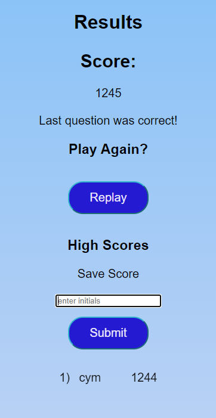

# Game-Quiz-Coding-CYM
 
## Description

This is a quiz game with a coding theme. After pressing the start button, the user tries to answer as many questions within the time limit. Afterwards they will see the score page. 

Code is written in JavaScript, HTML, and CSS.

## Features

For each correct answer the user gains 200 points and up to 50 bonus points. If the user gets a question incorrect, the time goes down and will not recieve any bonus points. Then it will show a score screen showing the score the user got, an option to play again, and a score board. If the user got a high score they are given a textbox to enter their intials (1-3 characters) to save their score. The score board only saves the top 10 highest scores and the user will not get an option to save if their score is is not high enough and the coreboard is already full.

To prevent a user from entering the same score multiple times, the submit form will disappear after entering and it will not reappear upon refresh. The only way to submit a new score is to play the quiz again.

The time (in seconds) is calculated based on how many questions there are, so if there are more questions added in the future the time will be automatically adjusted 

Calculations for time and bonus points:

timeLength = #ofQuestions * 10

scoreMultiplier = 50 /timeLength

score += 200 + (timeLength - howLongTheUserTookToAnswer) * scoreMultiplier

if answer was wrong: timeLength -= floor(timeLength/10)

## License

Please refer to the LICENSE in the repo.

## Link/Screentshot

https://cymcolor.github.io/Game-Quiz-Coding-Edition/

